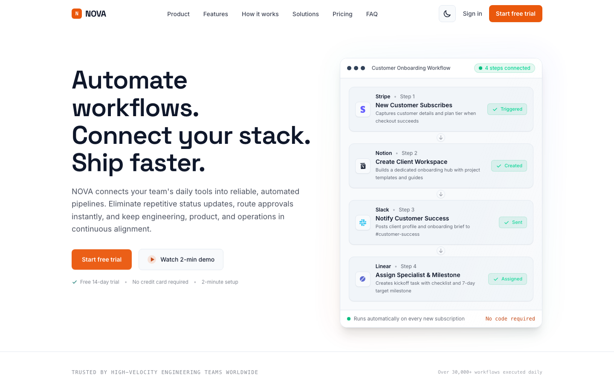
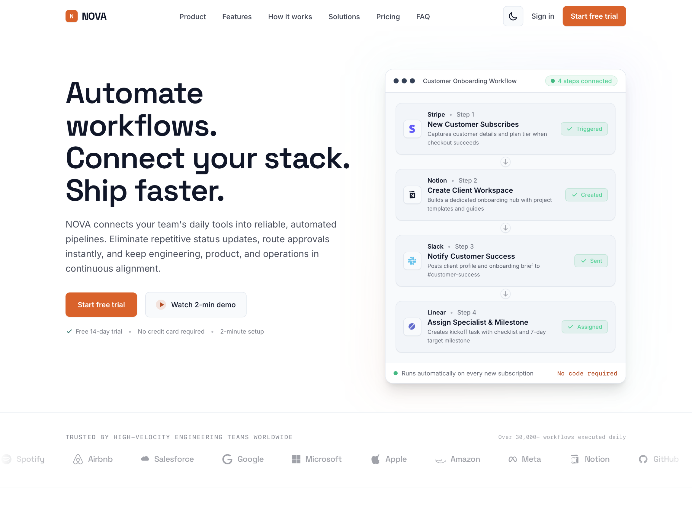
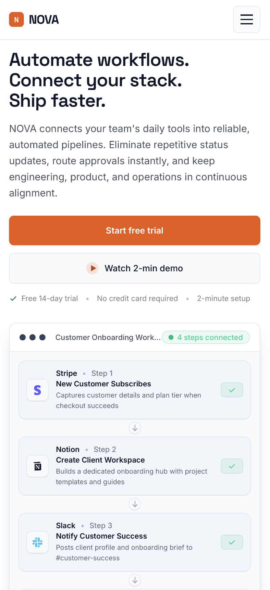

# NOVA — Build Better. Work Smarter.

A fully responsive, modern landing page for **NOVA**, a fictional AI
productivity platform, built as a front-end development intern assignment.

## Project description

NOVA helps teams plan projects, automate repetitive work and stay in sync
without extra status meetings. This project is the marketing landing page
for that product: a single-page site covering everything from the hero
through pricing and FAQ, built to feel like a real company site rather than
a tutorial project.

## Technologies used

- **Next.js 16** (App Router) — chosen because it's the preferred stack for
  the assignment and gives file-based routing, server components and a
  simple path to a production app later.
- **React 19** — component model for the whole UI.
- **TypeScript** — type safety for props and content data.
- **Tailwind CSS v4** — utility-first styling with a small custom design
  token layer (colors, fonts) defined in `globals.css`.
- **Google Fonts** — Space Grotesk (display/headings) and Inter (body text),
  loaded via a `<link>` tag so no extra build tooling is required.

No component libraries or UI kits were used — every section is a hand-built
component so the code stays easy to read and explain.

## Features

- **13 required sections**: navigation, hero, trusted-by strip, features (7),
  product/about, how it works, stats, solutions/use cases, testimonials,
  pricing (3 plans), FAQ (6 questions), final CTA, footer.
- **8/8 Bonus features fully implemented**:
  - **Dark/Light mode**: Persisted in `localStorage`, auto-detects `prefers-color-scheme`, synchronized theme transitions without flash.
  - **Testimonial carousel**: Swipeable touch gestures, auto-rotation with hover/focus pause, keyboard navigation (`←`/`→`), and dot indicators.
  - **Monthly/annual pricing toggle**: Interactive discount toggle with zero layout shift (`min-h` container).
  - **Interactive demo modal**: Accessible walkthrough simulation modal (`Esc` to close, focus trap, multi-step simulation).
  - **Newsletter / Waitlist validation**: Client-side feedback + Next.js API route (`/api/waitlist`) with RFC email validation.
  - **Animated statistics**: Number callouts with amber accenting.
  - **Scroll animations**: Load-in checklist ticking animations and draw-check SVGs.
  - **Back-to-top button**: Floating button appearing smoothly after scrolling 800px.
- **Responsive navigation**: Mobile hamburger menu (animated icon, slide-down panel, closes on link click, locks body scroll).
- **Accessibility & SEO**: WCAG-compliant contrast, `aria-expanded`, `aria-controls`, `role="region"`, skip-to-content link, and JSON-LD schema.

## Installation instructions

```bash
# install dependencies
npm install

# run the dev server
npm run dev
# open http://localhost:3000

# production build
npm run build
npm run start
```

Requires Node.js 18.18 or newer.

## Project structure

```
src/
  app/
    api/waitlist/route.ts  # server-side email validation API
    globals.css            # design tokens (colors, fonts, dark mode variables)
    layout.tsx             # fonts, metadata, skip-link, root HTML shell
    not-found.tsx          # branded custom 404 page
    page.tsx               # assembles all sections in order
  components/
    BackToTop.tsx          # floating scroll-to-top button
    DemoModal.tsx          # interactive product walkthrough tour
    FAQ.tsx                # accessible accordion
    Features.tsx           # flagship feature + hairline grid
    FinalCTA.tsx           # closing call to action + waitlist section
    Footer.tsx             # link columns + legal notices
    Hero.tsx               # headline, CTAs, animated checklist visual
    HowItWorks.tsx         # 4-step numbered sequence
    Navbar.tsx             # sticky nav + mobile drawer + theme toggle
    Pricing.tsx            # 3 plans with monthly/annual toggle
    Product.tsx            # dark section with live board mockup
    Solutions.tsx          # use-case list by team
    Stats.tsx              # 4 stat callouts
    Testimonials.tsx       # accessible interactive carousel
    ThemeProvider.tsx      # context provider for light/dark theme
    TrustedBy.tsx          # logo strip with marquee animation
    WaitlistForm.tsx       # validated email capture form
  lib/
    content.ts             # centralized content data
```

## Screenshots

Here is a preview of the responsive layout across different screen sizes:

<table width="100%">
  <tr>
    <th width="50%">Desktop View</th>
    <th width="30%">Tablet View</th>
    <th width="20%">Mobile View</th>
  </tr>
  <tr>
    <td valign="top"></td>
    <td valign="top"></td>
    <td valign="top"></td>
  </tr>
</table>

## Live demo URL

The landing page is live and deployed at: `https://nova.sampod.site`

## AI tools used

This project was built with assistance from **Claude** (Anthropic), used to:

- Scaffold the Next.js + Tailwind project structure.
- Draft component markup and Tailwind styling for each section.
- Write placeholder copy for a fictional company (NOVA).
- Review the design against common "AI-generated" visual clichés (cream +
  terracotta palettes, identical shadowed cards, ALL-CAPS eyebrows, etc.)
  and steer toward a more distinctive, left-aligned, hairline-grid look.

See `EXPLANATION.md` for how the code was reviewed and adapted rather than
used as-is.
